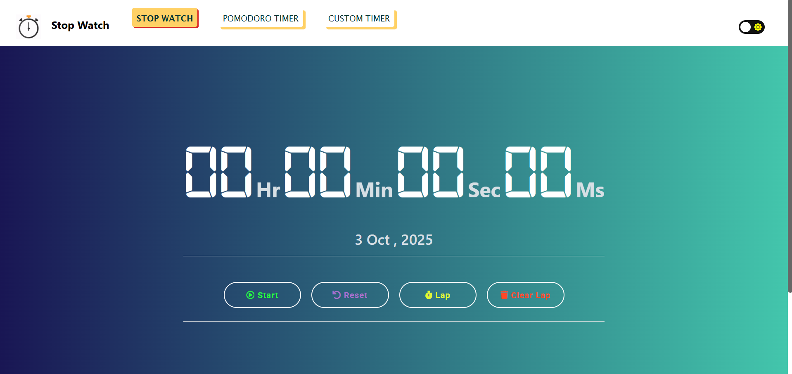
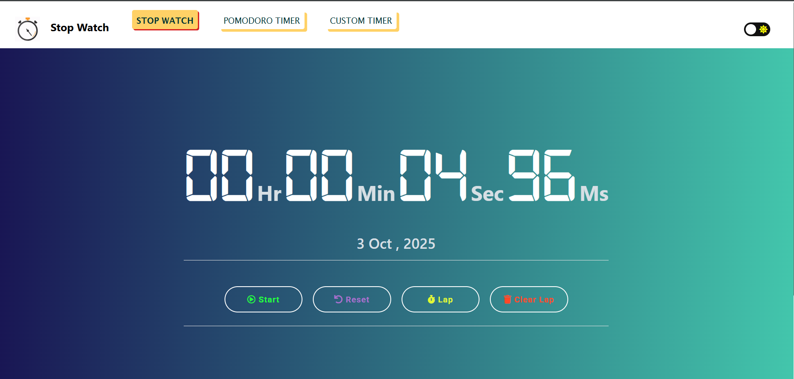
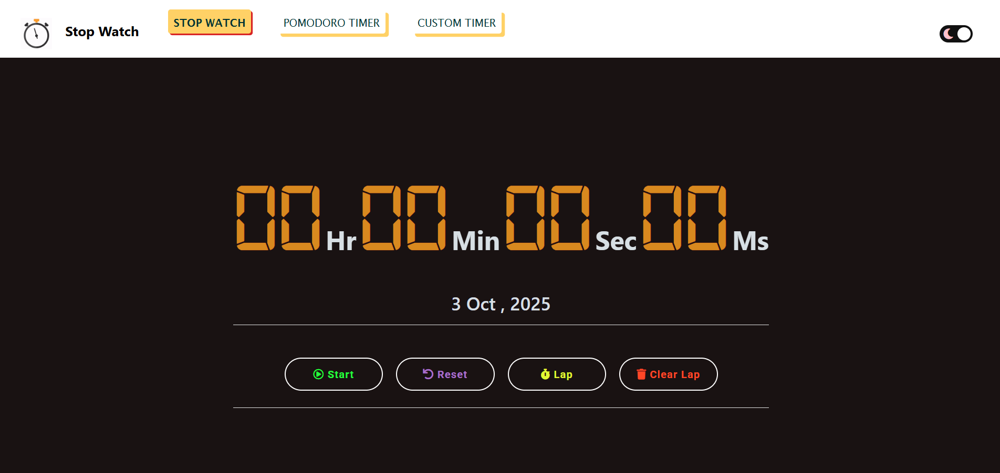
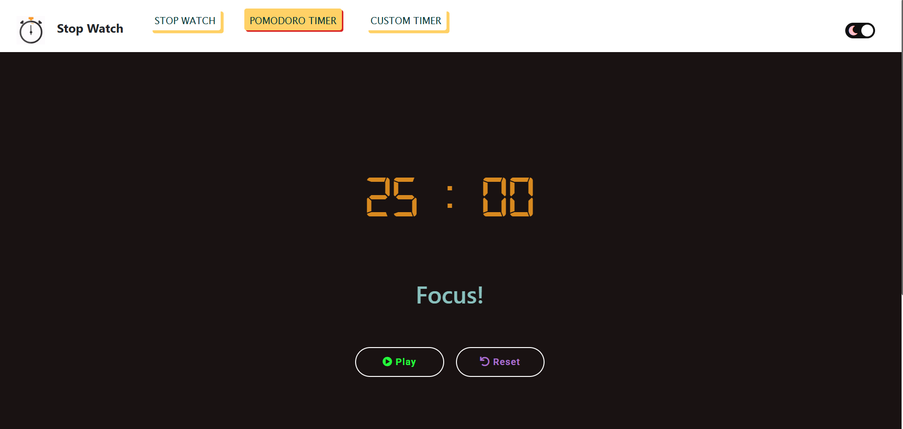
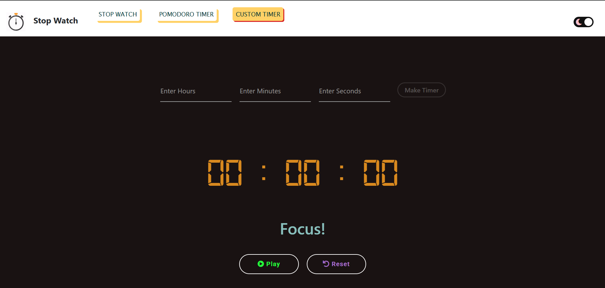
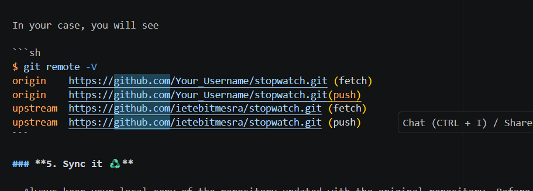

# ⏱️ Stopwatch by ANUJ JHA 🎉

[](https://anjx24.github.io/stopwatch/)

A **modern, feature-rich stopwatch** with beautiful UI, dark mode support, and advanced functionality. Built with **vanilla JavaScript, HTML, and CSS**.

---

## 🎯 Overview

Time is precious, and tracking it precisely is essential.  
This **Stopwatch** displays time in **HH:MM:SS:MS** `(hour:minute:second:millisecond)` format.  
It includes **Pomodoro timers, custom countdown timers**, and **persistent dark/light mode**.


---

## 🛠️ Tech Stack

- **HTML5** - Semantic markup
- **CSS3** - Modern styling with glassmorphism & animations
- **JavaScript (ES6+)** - Vanilla JS for optimal performance
- **Bootstrap 5** - Responsive grid system
- **Font Awesome** - Beautiful icons
- **Audio** - Start, pause, reset, lap sounds

---

## ✨ Features

### Core Stopwatch

- ⏲️ **Precise Time Display**: HH:MM:SS:MS
- ▶️ **Start / Pause**: Smooth toggle
- 🔄 **Reset**: Clear time and laps
- 🏁 **Lap Timer**: Record multiple laps
- 🗑️ **Clear Laps**

### Dark / Light Mode

- 🌙 Seamless **theme switching**
- 💾 **Persistent Preference** saved automatically
- 🌈 **Glassmorphism UI** for a modern look

### Local Storage & Persistence

- 💿 **Auto-save** stopwatch state
- 🔄 **Resume on reload** (up to 24 hours)
- 🎯 **Smart Recovery** restores recent sessions

### Sound & Interactions

- 🔊 Optional ticking sound
- 🎵 Audio feedback for start, pause, reset, laps
- ⌨️ **Keyboard Shortcuts**:
  - Space → Start/Pause
  - R → Reset
  - L / Enter → Record Lap
  - Backspace → Reset
  - P → Start/Pause (alternative)
  - Numpad 0 → Clear Laps

### Additional Timers

- 🍅 **Pomodoro Timer**
- ⏲️ **Custom Countdown Timer**

### Responsive & Modern UI

- 📱 Mobile & tablet optimized
- 💻 Desktop ready with adaptive layout
- 🎨 Touch-friendly buttons
- 🌟 Rounded buttons with smooth animations
- 🖼️ Optional lofi video background

---

## 🚀 Quick Start

### 1️⃣ Live Demo

[Open Live Site](https://anjx24.github.io/stopwatch/)
### 2️⃣ Run Locally

````bash
# Clone the repository
git clone https://github.com/ANJx24/stopwatch.git
cd stopwatch

# Open index.html in browser
# Or run a local server
python -m http.server 8000
# Then visit http://localhost:8000


## 🚀 Quick Start

### Option 1: Visit the Live Site
Simply visit ([https://anjx24.github.io/stopwatch/](https://anjx24.github.io/stopwatch/)) to use the stopwatch immediately!

### Option 2: Run Locally

1. **Clone the repository**
   ```bash
   git clone https://github.com/ANJx24
   cd stopwatch
````

2. **Open in browser**

   ```bash
   # Simply open index.html in your browser
   # Or use a local server:
   python -m http.server 8000
   # Then visit http://localhost:8000
   ```

3. **Start using!**
   - Click Start or press Space to begin
   - Press L to record laps
   - Press R to reset
   - Toggle dark mode with the switch in the navbar

## 📖 Usage Guide

### Basic Operations

1. **Start/Pause**: Click the Start button or press `Space`
2. **Reset**: Click Reset or press `R` to clear everything
3. **Record Lap**: Click Lap or press `L` while running
4. **Clear Laps**: Click Clear Lap to remove all lap records
5. **Dark Mode**: Toggle the switch in the top-right corner

### Keyboard Shortcuts Cheat Sheet

| Key         | Action                      |
| ----------- | --------------------------- |
| `Space`     | Start/Pause                 |
| `R`         | Reset                       |
| `L`         | Record Lap                  |
| `E`         | Export Laps                 |
| `Ctrl+→`    | Next Video (NEW!)           |
| `Ctrl+←`    | Previous Video (NEW!)       |
| `Ctrl+1-4`  | Jump to Video 1-4 (NEW!)    |
| `Ctrl+V`    | Toggle Auto-Rotation (NEW!) |
| `Enter`     | Record Lap                  |
| `Backspace` | Reset                       |
| `P`         | Start/Pause                 |
| `Numpad 0`  | Clear Laps                  |

## 🎨 Screenshots

> Interface of the StopWatch



> StopWatch Started



> Dark-Mode On



> Pomodoro Timer



> Custom Timer



## 🤝 Contributing

We welcome contributions! Please follow these guidelines:

## **Note: First create an issue then make a pull request :)**

## **How to be a contributor to the project 😎**<br>

### **1. Star The Repo :star2:**

- Star this repository by pressing the top-rightmost button to start your incredible journey.
- Create an issue describing how you want to contribute to this project.

### **2. Fork it :fork_and_knife:**

- Then fork this repository by using the <kbd><b>Fork</b></kbd> button on top-right of your screen.

- In the forked repository add your changes.

### **3. Clone it :busts_in_silhouette:**

`NOTE: commands are to be executed on Linux, Mac, and Windows(using Powershell)`

- You need to clone (download) it to a local machine using

```sh
$ git clone https://github.com/ANJx24
```

> This makes a local copy of the repository in your machine.

- Then make a pull request with the issue number.
- Once you have cloned the stopwatch repository in Github, move to that folder first using the change directory command on Linux, Mac, and Windows(PowerShell to be used).

```sh
# This will change the directory to a folder stopwatch
$ cd stopwatch
```

Move to this folder for all other commands.

### **4. Set it up ⬆️**

- Run the following commands to see that your local copy has a reference to your forked remote repository in Github :octocat:

```sh
$ git remote -v
origin  https://github.com/Your_Username/stopwatch.git (fetch)
origin  https://github.com/Your_Username/stopwatch.git (push)
```

Now, let's add a reference to the original stopwatch repository using

```sh
$ git remote add upstream https://github.com/avinash201199/stopwatch.git
```

This adds a new remote named upstream.

See the changes using

```sh
$ git remote -v
origin    https://github.com/Your_Username/stopwatch.git (fetch)
origin    https://github.com/Your_Username/stopwatch.git (push)
upstream  https://github.com/Remote_Username/stopwatch.git (fetch)
upstream  https://github.com/Remote_Username/stopwatch.git (push)
```

In your case, you will see

```sh
$ git remote -V
origin    https://github.com/Your_Username/stopwatch.git (fetch)
origin    https://github.com/Your_Username/stopwatch.git(push)
upstream  https://github.com/ietebitmesra/stopwatch.git (fetch)
upstream  https://github.com/ietebitmesra/stopwatch.git (push)
```

### **5. Sync it ♻️**

- Always keep your local copy of the repository updated with the original repository. Before making any changes and/or in an appropriate interval, run the following commands carefully to update your local repository.

```sh
# Fetch all remote repositories and delete any deleted remote branches ``
$ git fetch --all --prune
```

```sh
# Switch to `master` branch
$ git checkout master
```

```sh
# Reset local `master` branch to match the `upstream` repository's `master` branch
$ git reset --hard upstream/master
```

```sh
# Push changes to your forked `stopwatch` repo
$ git push origin master
```

### **6. Ready Steady Go... 🐢 🐇**

- Once you have completed these steps, you are ready to start contributing by checking our Help Wanted Issues and creating pull requests.

### **7. Create a new branch ‼️**

- Whenever you are going to contribute. Please create a separate branch using command and keep your master branch clean (i.e. synced with remote branch).

```sh
# It will create a new branch with name Branch_Name and switch to branch Folder_Name
$ git checkout -b BranchName
```

- Create a separate branch for contribution and try to use the same name of the branch as of folder.

To switch to the desired branch

```sh
# To switch from one folder to other
$ git checkout BranchName
To add the changes to the branch. Use
```

```sh
# To add all files to branch Folder_Name
$ git add .
Type in a message relevant for the code reviewer using
```

```sh
# This message gets associated with all files you have changed
$ git commit -m 'relevant message'
```

Now, Push your awesome work to your remote repository using

```sh
# To push your work to your remote repository
$ git push -u origin BranchName
```

- Finally, go to your repository in the browser and click on compare and pull requests. Then add a title and description to your pull request that explains your precious efforts

### **8. Pull requests should have screenshots of the changes you have made.**

### **9. Wait for review. :heart:**

---

## 📦 Project Structure

```
stopwatch/
├── index.html          # Main stopwatch page
├── script.js           # Core stopwatch logic with localStorage
├── style.css           # Styling with glassmorphism effects
├── audio/              # Sound effects
│   ├── beep_cut.mp3
│   ├── sound_trim.mp3
│   └── ticking.mp3
├── img/                # Images and screenshots
├── pomodoro/           # Pomodoro timer feature
├── custom_timer/       # Custom countdown timer
└── README.md           # This file
```

## 🌟 What's New in This Version

### Recent Enhancements (2025)

- ✅ **Enhanced Voice Control** - Hands-free operation with natural language commands
- ✅ **Lap Export Functionality** - Export lap times to CSV with timestamps
- ✅ **Local Storage Support** - Never lose your progress on reload
- ✅ **Enhanced Sound Effects** - Start, pause, reset, and lap sounds
- ✅ **Improved Keyboard Shortcuts** - Space, R, L, E for quick actions
- ✅ **Code Cleanup** - Better organization and comments
- ✅ **Modern UI Updates** - Enhanced glassmorphism and animations
- ✅ **Persistent Dark Mode** - Your theme preference is saved
- ✅ **Updated Documentation** - Comprehensive README with usage guide

## 💡 Tips & Tricks

1. **Quick Start**: Press `Space` to instantly start the stopwatch
2. **Rapid Laps**: Use `L` key for quick lap recording during activities
3. **Theme Preference**: Your dark/light mode choice persists across sessions
4. **Auto-Save**: The stopwatch automatically saves your progress every second
5. **Keyboard Master**: Learn the shortcuts for a seamless experience

## 🐛 Known Issues & Limitations

- Video background may not load on slower connections (graceful fallback)
- Audio may require user interaction on some browsers due to autoplay policies
- LocalStorage limited to 24-hour persistence (by design)

## 🙏 Acknowledgments

- **Original Creator:** Anuj Jha – for building the foundation of this stopwatch project
- **Enhancements & Contributions:** Hector JS and the amazing open-source community
- **Icons & Graphics:** Font Awesome – for the crisp and professional icons
- **Fonts:** Google Fonts – for the modern typography
- **Background Animation:** Lofi video animation – for the relaxing, aesthetic UI
- **Special Thanks:** To all contributors who help improve this project and make it Hacktoberfest-ready! 🎉

## 📞 Connect with the Creator

<a href="https://www.linkedin.com/in/jha-anuj/"></img></a>
<a href=""></img></a>

## 👥 Our Contributors

Thank you to all the amazing contributors who have helped make this project better! 🎉

<a href="https://github.com/ANJx24/stopwatch/graphs/contributors">
  
</a>

---

<div align="center">
  <p><strong>⭐ If you like this project, please give it a star! ⭐</strong></p>
  <p>Made by ❤️ Anuj Jha</p>
</div>
